# ERD — Skema Database

Diupdate otomatis setiap ada perubahan skema (tabel/kolom/relasi baru).

Terakhir diupdate: 2026-08-24 (setelah Iterasi 18 — Fase 4, fondasi Draft/Publish)

## Catatan penting

- Semua tabel konten (`projects`, `blog_posts`, `experiences`, `testimonials`, `skills`) **independen satu sama lain** — tidak ada foreign key relasional di antara mereka. Masing-masing punya business key unik sendiri (`project_key`, `post_key`, dst) yang dipakai sebagai referensi stabil di kode, terpisah dari `id` auto-increment.
- `users` dipakai murni untuk login admin — tidak berelasi ke tabel konten manapun.
- `site_profiles` bersifat singleton (selalu 1 baris, id = 1).
- Kolom `sort_order` dipakai untuk urutan tampil manual di halaman publik (bisa diubah lewat admin, defaultnya urutan seed).

## Diagram

```mermaid
erDiagram
    USERS {
        bigint id PK
        string name
        string email
        string password
        timestamp email_verified_at
        timestamps created_at_updated_at
    }

    PROJECTS {
        bigint id PK
        string project_key UK
        string title
        string tagline
        text description
        text long_description
        string category
        string role
        string timeline
        string client
        string image "nullable sejak Iterasi 9"
        json tags
        json metrics
        json highlights
        json tech_stack
        string demo_url
        string github_url
        boolean featured
        string color_gradient "nullable sejak Iterasi 9"
        string accent_color "nullable sejak Iterasi 9"
        int sort_order
        json hidden_blocks "nullable, ditambah Iterasi 28 — array block-key opsional yg disembunyikan admin di halaman detail publik (metrics/highlights/tech_frontend/tech_backend/tech_database/tech_cloud/tab_preview)"
    }

    BLOG_POSTS {
        bigint id PK
        string post_key UK
        string title
        string slug UK
        text summary
        string category
        json tags
        string read_time
        string published_at
        string cover_image "nullable sejak Iterasi 9"
        string author_name
        string author_role
        string author_avatar "nullable sejak Iterasi 9"
        int likes
        string views
        json sections
        int sort_order
    }

    EXPERIENCES {
        bigint id PK
        string experience_key UK
        string period
        string role
        string company
        string location
        string type
        text description
        json achievements
        json skills
        boolean featured
        int sort_order
    }

    TESTIMONIALS {
        bigint id PK
        string testimonial_key UK
        string name
        string role
        string company
        string avatar "nullable sejak Iterasi 9"
        text content
        tinyint rating
        string project_tag "nullable sejak Iterasi 9"
        int sort_order
    }

    SKILLS {
        bigint id PK
        string name
        string category
        tinyint level
        string experience
        string icon_name
        string highlight_text "nullable sejak Iterasi 9"
        int sort_order
    }

    CONTACT_MESSAGES {
        bigint id PK
        string name
        string email
        string project_type
        string budget
        string timeline
        text message
        boolean is_read "default false, ditambah Iterasi 8"
    }

    SITE_PROFILES {
        bigint id PK "selalu 1 (singleton)"
        string name
        string nickname
        string title_id
        string title_en
        text tagline_id
        text tagline_en
        text bio_id
        text bio_en
        string location
        string email
        string phone
        string github
        string linkedin
        string twitter
        boolean available_for_work
        string years_of_exp
        string completed_projects
        string client_satisfaction
        string open_source_contributions
        string avatar
        string secondary_avatar
    }

    SOCIAL_LINKS {
        bigint id PK
        string platform
        string name
        string url
        string username
        string icon
        string bg_color
        string text_color
        string description
        boolean is_active
        int sort_order
    }

    SECTION_SETTINGS {
        bigint id PK
        string section_key UK "hero/about/skills/projects/experience/blog/testimonials/contact (playground dihapus Iterasi 19, lihat riwayat)"
        string label
        boolean is_active
        int sort_order
        int display_count "nullable, ditambah Iterasi 18 — hanya relevan utk section list (projects/blog/testimonials)"
        string heading_id "nullable, ditambah Iterasi 18"
        string heading_en "nullable, ditambah Iterasi 18"
        text subheading_id "nullable, ditambah Iterasi 18"
        text subheading_en "nullable, ditambah Iterasi 18"
        json draft_overrides "nullable, ditambah Iterasi 18 — partial field yg punya perubahan draft pending"
    }

    DISPLAY_SETTINGS {
        bigint id PK
        string setting_key UK "ditambah Iterasi 18, mis. animations_enabled"
        text value "nullable — nilai LIVE, dibaca visitor publik"
        text value_draft "nullable — nilai DRAFT pending, NULL = tidak ada perubahan pending"
        timestamps created_at_updated_at
    }
```

> Catatan render: seluruh tabel di diagram di atas — `PROJECTS`, `BLOG_POSTS`, `EXPERIENCES`, `TESTIMONIALS`, `SKILLS`, `CONTACT_MESSAGES`, `USERS`, `SITE_PROFILES`, `SOCIAL_LINKS`, `SECTION_SETTINGS`, `DISPLAY_SETTINGS` — **sudah ada** di database (MySQL `bagus_batra_portfolio`). `CONTACT_MESSAGES.is_read` ditambahkan di Iterasi 8; 8 kolom lain dijadikan nullable di Iterasi 9; `DISPLAY_SETTINGS` (tabel baru) dan 6 kolom baru di `SECTION_SETTINGS` ditambahkan di Iterasi 18 (Fase 4); `PROJECTS.hidden_blocks` ditambahkan di Iterasi 28 (Fase 5) — lihat riwayat di bawah. Tidak ada lagi kolom berstatus `[RENCANA]`.

## Riwayat perubahan skema

- **2026-08-25 (Iterasi 28, Fase 5 — Projects: Redesain Layout Admin + Hide/Unhide Blok)** — Kolom baru `projects.hidden_blocks` (JSON, nullable) via migrasi `2026_08_25_165001_add_hidden_blocks_to_projects_table.php` — array block-key string (`metrics`/`highlights`/`tech_frontend`/`tech_backend`/`tech_database`/`tech_cloud`/`tab_preview`) yang admin sembunyikan paksa per-project di halaman detail publik, meski datanya terisi. NULL/kosong = semua blok tampil (100% backward compatible, tidak ada baris existing yang berubah perilaku). Direct-live (BUKAN lewat draft/publish Fase 4) — konsisten dengan seluruh CRUD Projects sejak Fase 1. Bukan struktur relasional baru — pola sama dengan `tags`/`metrics`/`highlights`/`tech_stack` (array JSON sederhana), divalidasi di level aplikasi (`Admin\ProjectController::HIDEABLE_BLOCKS`), bukan di skema.
- **2026-08-24 (Iterasi 19, Fase 4 — Preset Warna Aksen & Logo/Branding)** — Data cleanup, BUKAN perubahan struktur kolom: migrasi `2026_08_24_090000_remove_playground_section_setting_row.php` menghapus 1 baris `section_settings` yatim (`section_key='playground'`) — section-nya sudah dihapus total dari kode publik sejak commit `d1d2774` (di luar Fase 4), tapi baris DB-nya baru dibersihkan sekarang. `section_settings` sekarang 8 baris (bukan 9); `sort_order` sisanya dirapikan sekaligus (0-7 tanpa lubang). `SectionSettingSeeder` diupdate senada supaya `migrate:fresh --seed` juga menghasilkan 8 baris untuk instalasi baru. Tidak ada tabel/kolom baru — 2 setting baru Iterasi 19 (`accent_preset`, `logo_type`, `logo_image`) disimpan sebagai baris di tabel key-value `display_settings` yang sudah ada sejak Iterasi 18, bukan kolom baru.
- **2026-08-24 (Iterasi 18, Fase 4 — Kustomisasi Tampilan)** — Fondasi mekanisme Draft/Publish untuk kustomisasi tampilan halaman index. Tabel baru `display_settings` (`setting_key` unik, `value`/`value_draft` text nullable, timestamps) via migrasi `2026_08_24_035143_create_display_settings_table.php` — key-value generik untuk pengaturan tampilan (preset warna, logo, toggle animasi/efek, sub-elemen halaman, maintenance mode — bukan menambah kolom nullable ke `site_profiles`, supaya setting baru di Iterasi 19-22 tidak perlu migration berulang). 6 kolom baru di `section_settings` via migrasi `2026_08_24_035144_add_appearance_columns_to_section_settings_table.php`: `display_count` (unsignedInteger nullable, relevan utk section list), `heading_id`/`heading_en` (string nullable), `subheading_id`/`subheading_en` (text nullable), `draft_overrides` (JSON nullable — object partial berisi field yg punya perubahan draft pending, dipilih ketimbang kolom `*_draft` terpisah per field supaya field draft-able baru di iterasi berikutnya tidak perlu migration tambahan). Bukti konsep end-to-end (`animations_enabled` di `display_settings`) diverifikasi lolos 8/8 skenario draft→preview→publish/discard (lihat `docs/LOG-ITERASI.md` entri Iterasi 18) — tidak ada kehilangan/perubahan data existing, kedua migrasi murni `ADD COLUMN`/`CREATE TABLE`.
- **2026-08-23 (Iterasi 9)** — Ditemukan saat regresi CRUD penuh (create tanpa mengisi field gambar/teks opsional): 8 kolom dibuat `NOT NULL` tanpa default sejak skema awal (sebelum Fase 1, saat digenerate dari seed data yang selalu lengkap), padahal validasi & form admin CRUD (Iterasi 3/4/6/7) semuanya sudah memperlakukan kolom ini sebagai opsional (`nullable` di rule validasi, tanpa atribut `required` di form) — inkonsistensi ini membuat create/update via admin **crash 500** setiap kali field terkait dikosongkan. Diperbaiki dengan 2 migrasi (`ALTER TABLE ... MODIFY ... NULL`, tanpa dependency `doctrine/dbal`): `projects.color_gradient`, `projects.accent_color`, `projects.image`, `blog_posts.cover_image`, `blog_posts.author_avatar`, `testimonials.avatar`, `testimonials.project_tag`, `skills.highlight_text` — semuanya dijadikan `nullable`. Tidak ada kehilangan data (5/4/3/12 baris seed yang ada sudah punya nilai non-null di kolom ini); tidak ada perubahan pada field yang publiknya benar-benar membutuhkan nilai (title, name, category, dst — semua tetap `NOT NULL` & `required`).
- **2026-08-23 (Iterasi 8)** — Kolom baru `is_read` (boolean, default `false`) ditambahkan ke `contact_messages` via migrasi `2026_08_23_060959_add_is_read_to_contact_messages_table.php`. Dipakai untuk status baca/belum-dibaca pesan kontak di menu admin "Pesan Masuk" — ditandai otomatis `true` saat admin membuka detail pesan.
- **2026-08-23 (Iterasi 7)** — Tidak ada perubahan skema. `testimonials` mendapat CRUD admin penuh dengan star rating picker interaktif; `testimonial_key` immutable dari sisi admin (sama pola dengan key iterasi sebelumnya).
- **2026-08-23 (Iterasi 6)** — Tidak ada perubahan skema. `blog_posts` mendapat CRUD admin penuh (form paling kompleks sejauh ini karena `sections` adalah array objek dgn sub-objek opsional `codeSnippet`); `post_key` dan `slug` immutable dari sisi admin (sama pola dengan `project_key`/`experience_key`).
- **2026-08-23 (Iterasi 5)** — Tidak ada perubahan skema. `experiences` mendapat CRUD admin penuh; `experience_key` immutable dari sisi admin (sama pola dengan `project_key` di Iterasi 4).
- **2026-08-23 (Iterasi 4)** — Tidak ada perubahan skema. `projects` (sudah ada sebelum Fase 1, termasuk kolom JSON `tags`/`metrics`/`highlights`/`tech_stack`) mendapat CRUD admin penuh dengan repeater untuk keempat kolom JSON tersebut. `project_key` diputuskan immutable dari sisi admin (dibuat otomatis dari judul saat create, tidak bisa diedit) — bukan perubahan skema, murni aturan di level aplikasi.
- **2026-08-23 (Iterasi 3)** — Tidak ada perubahan skema. `skills` (sudah ada sebelum Fase 1) mendapat CRUD admin penuh (menu About & Skills); halaman publik sudah membaca dari tabel ini sejak awal (bukan config), jadi tidak ada perubahan di sisi controller publik.
- **2026-08-23 (Iterasi 2)** — Tidak ada perubahan skema. `site_profiles` & `social_links` (sudah ada sejak Iterasi 0) mulai punya CRUD/edit admin nyata (Profil & Hero, Social Links) dan mulai dikonsumsi langsung oleh halaman publik (`PortfolioController`) menggantikan `config('portfolio.*')`. `php artisan storage:link` dijalankan untuk pertama kali (dibutuhkan fitur upload avatar) — bukan perubahan skema, tapi dicatat karena bagian dari environment setup.
- **2026-08-23 (Iterasi 1)** — Tidak ada perubahan skema. `section_settings` yang sudah ada sejak Iterasi 0 mulai dipakai penuh (toggle admin real-time + halaman publik menghormati `is_active`); hanya isi kolom `label` yang diupdate (Bahasa Indonesia) via `SectionSettingSeeder`, bukan struktur tabel.
- **2026-08-23 (Iterasi 0)** — Database dipindah dari SQLite ke MySQL (`bagus_batra_portfolio`, Laragon). Tabel baru ditambahkan: `site_profiles` (singleton, id=1, diisi dari `config('portfolio.personal_info')`), `social_links` (diisi dari `config('portfolio.social_links')`), `section_settings` (9 baris seed: hero, about, skills, projects, playground, experience, blog, testimonials, contact — semua `is_active=true`). Tabel lama (`projects`, `blog_posts`, `experiences`, `testimonials`, `skills`, `contact_messages`, `users`) dimigrasikan ulang ke MySQL tanpa perubahan kolom — tidak ditemukan isu kompatibilitas tipe data SQLite→MySQL. `users` juga menerima 1 baris admin baru via `AdminUserSeeder` (di luar seeder `User::factory()` bawaan yang tetap dipertahankan).
- **2026-08-23** — Baseline dicatat (hasil konversi React → Laravel sebelumnya): `projects`, `blog_posts`, `experiences`, `testimonials`, `skills`, `contact_messages`, `users` (bawaan Laravel). Rencana penambahan `site_profiles`, `social_links`, `section_settings`, dan kolom `is_read` di `contact_messages` dicatat untuk Iterasi 0 & 8.
