# ERD — Skema Database

Diupdate otomatis setiap ada perubahan skema (tabel/kolom/relasi baru).

Terakhir diupdate: 2026-08-23 (setelah Iterasi 0 — fondasi admin panel)

## Catatan penting

- Semua tabel konten (`projects`, `blog_posts`, `experiences`, `testimonials`, `skills`) **independen satu sama lain** — tidak ada foreign key relasional di antara mereka. Masing-masing punya business key unik sendiri (`project_key`, `post_key`, dst) yang dipakai sebagai referensi stabil di kode, terpisah dari `id` auto-increment.
- `users` dipakai murni untuk login admin — tidak berelasi ke tabel konten manapun.
- `site_profiles` bersifat singleton (selalu 1 baris, id = 1).
- Kolom `sort_order` dipakai untuk urutan tampil manual di halaman publik (bisa diubah lewat admin, defaultnya urutan seed).

## Diagram

```mermaid
erDiagram
    USERS {
        bigint id PK
        string name
        string email
        string password
        timestamp email_verified_at
        timestamps created_at_updated_at
    }

    PROJECTS {
        bigint id PK
        string project_key UK
        string title
        string tagline
        text description
        text long_description
        string category
        string role
        string timeline
        string client
        string image
        json tags
        json metrics
        json highlights
        json tech_stack
        string demo_url
        string github_url
        boolean featured
        string color_gradient
        string accent_color
        int sort_order
    }

    BLOG_POSTS {
        bigint id PK
        string post_key UK
        string title
        string slug UK
        text summary
        string category
        json tags
        string read_time
        string published_at
        string cover_image
        string author_name
        string author_role
        string author_avatar
        int likes
        string views
        json sections
        int sort_order
    }

    EXPERIENCES {
        bigint id PK
        string experience_key UK
        string period
        string role
        string company
        string location
        string type
        text description
        json achievements
        json skills
        boolean featured
        int sort_order
    }

    TESTIMONIALS {
        bigint id PK
        string testimonial_key UK
        string name
        string role
        string company
        string avatar
        text content
        tinyint rating
        string project_tag
        int sort_order
    }

    SKILLS {
        bigint id PK
        string name
        string category
        tinyint level
        string experience
        string icon_name
        string highlight_text
        int sort_order
    }

    CONTACT_MESSAGES {
        bigint id PK
        string name
        string email
        string project_type
        string budget
        string timeline
        text message
        boolean is_read "[RENCANA] ditambah Iterasi 8"
    }

    SITE_PROFILES {
        bigint id PK "selalu 1 (singleton)"
        string name
        string nickname
        string title_id
        string title_en
        text tagline_id
        text tagline_en
        text bio_id
        text bio_en
        string location
        string email
        string phone
        string github
        string linkedin
        string twitter
        boolean available_for_work
        string years_of_exp
        string completed_projects
        string client_satisfaction
        string open_source_contributions
        string avatar
        string secondary_avatar
    }

    SOCIAL_LINKS {
        bigint id PK
        string platform
        string name
        string url
        string username
        string icon
        string bg_color
        string text_color
        string description
        boolean is_active
        int sort_order
    }

    SECTION_SETTINGS {
        bigint id PK
        string section_key UK "hero/about/skills/projects/playground/experience/blog/testimonials/contact"
        string label
        boolean is_active
        int sort_order
    }
```

> Catatan render: seluruh tabel di diagram di atas — `PROJECTS`, `BLOG_POSTS`, `EXPERIENCES`, `TESTIMONIALS`, `SKILLS`, `CONTACT_MESSAGES`, `USERS`, `SITE_PROFILES`, `SOCIAL_LINKS`, `SECTION_SETTINGS` — **sudah ada** di database (MySQL `bagus_batra_portfolio`) sejak Iterasi 0 selesai. Satu-satunya kolom yang masih berstatus `[RENCANA]` adalah `is_read` pada `CONTACT_MESSAGES`, dikerjakan di Iterasi 8.

## Riwayat perubahan skema

- **2026-08-23 (Iterasi 0)** — Database dipindah dari SQLite ke MySQL (`bagus_batra_portfolio`, Laragon). Tabel baru ditambahkan: `site_profiles` (singleton, id=1, diisi dari `config('portfolio.personal_info')`), `social_links` (diisi dari `config('portfolio.social_links')`), `section_settings` (9 baris seed: hero, about, skills, projects, playground, experience, blog, testimonials, contact — semua `is_active=true`). Tabel lama (`projects`, `blog_posts`, `experiences`, `testimonials`, `skills`, `contact_messages`, `users`) dimigrasikan ulang ke MySQL tanpa perubahan kolom — tidak ditemukan isu kompatibilitas tipe data SQLite→MySQL. `users` juga menerima 1 baris admin baru via `AdminUserSeeder` (di luar seeder `User::factory()` bawaan yang tetap dipertahankan).
- **2026-08-23** — Baseline dicatat (hasil konversi React → Laravel sebelumnya): `projects`, `blog_posts`, `experiences`, `testimonials`, `skills`, `contact_messages`, `users` (bawaan Laravel). Rencana penambahan `site_profiles`, `social_links`, `section_settings`, dan kolom `is_read` di `contact_messages` dicatat untuk Iterasi 0 & 8.
